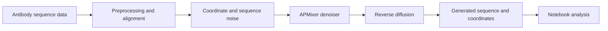

# AbDiffuser — Antibody Diffusion Research

**Exploring joint amino-acid sequence and three-dimensional coordinate generation.**

A team research implementation studying diffusion models for antibody design. The project combines continuous coordinate denoising and discrete sequence modeling with an APMixer backbone, supported by preprocessing, training, sampling, and notebook-based exploration.

## Research workflow



## Technology

Python · PyTorch · NumPy · Pandas · Biopython · scikit-learn · Matplotlib · Seaborn. CUDA is used when available and configured.

## Start exploring

The implementation lives in [`abdiffuser 2/`](abdiffuser%202/).

| Component | Path |
| --- | --- |
| Diffusion process | [`models/diffusion.py`](abdiffuser%202/models/diffusion.py) |
| APMixer backbone | [`models/apmixer.py`](abdiffuser%202/models/apmixer.py) |
| Priors and projection | [`models/`](abdiffuser%202/models/) |
| Data preparation | [`scripts/preprocess_data_fixed.py`](abdiffuser%202/scripts/preprocess_data_fixed.py) |
| Training | [`scripts/train_model.py`](abdiffuser%202/scripts/train_model.py) |
| Sampling | [`scripts/generate.py`](abdiffuser%202/scripts/generate.py) |
| Experiments and plots | [`Outputs.ipynb`](abdiffuser%202/Outputs.ipynb) |

## Environment and execution

```sh
cd "abdiffuser 2"
python -m venv .venv
source .venv/bin/activate
pip install -r requirements.txt
```

The scripts retain paths from the original `abdiffuser` project layout. Review imports and update data/output paths to your local checkout before training. Training accepts `--oas_data`, `--output_dir`, `--num_epochs`, and `--device`; generation requires `--checkpoint`. Checkpoints and processed data must match the model configuration. The requirements preserve the original experiment versions.

## Scope and interpretation

This repository is a student research implementation inspired by the AbDiffuser paper, not the original authors’ official implementation. Generated coordinates and notebook plots are exploratory artifacts. They do not establish experimentally validated antibody binding, therapeutic effectiveness, or reproduction of the paper’s published results.

[Watch the team presentation](https://www.youtube.com/watch?v=SSFUJwct3KA).

## Team

Pradyumna Raghavendra · Manvith Reddy Dalli · Udaykumar Patel.
